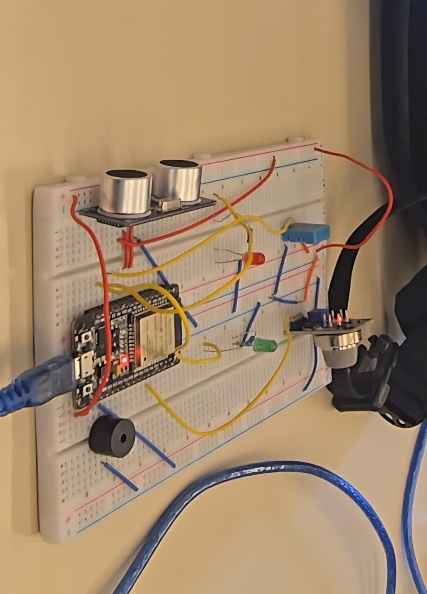

# HSSMS Project Submission Template

## Part 1: Hardware Implementation (ESP32)

### Breadboard Circuit Image


### Arduino C Code
[HSSMS.ino](HSSMS.ino)

### Library Documentation

* **Library Name:** DHT sensor library by Adafruit
    * **Version:** 1.4.7
    * **Installation Steps:**
        1. Open the Arduino IDE
        2. Navigate to **Sketch** > **Include Library** > **Manage Libraries...**
        3. Search for "DHT sensor library" and select the version by Adafruit
        4. Install the "Adafruit Unified Sensor" library if prompted as a mandatory dependency

* **Library Name:** Async TCP by ESP32Async
    * **Version:** 3.4.10
    * **Installation Steps:**
        1. Open the Arduino IDE Library Manager
        2. Search for "AsyncTCP"
        3. Select the version by ESP32Async and click **Install**

* **Library Name:** ESP Async WebServer by ESP32Async
    * **Version:** 3.10.3
    * **Installation Steps:**
        1. Open the Arduino IDE Library Manager
        2. Search for "ESP Async WebServer"
        3. Select the version by ESP32Async and click **Install**

### Firmware Upload Procedure

1. Step 1 - Connect USB to ESP32
2. Step 2 - Select correct the correct port in Arduino IDE
3. Step 3 - Select board type: ESP32 Dev Module
4. Step 4 - Configure baud rate: 115200 so you can see output in serial monitor
5. Step 5 - Click Upload

### Demonstration Video


### Google Form Submission
[Confirm submission to https://forms.gle/twd7B3CIAL34cD1A8]

---

## Part 2: Cooja Simulation

### Simulation Files
[HSSMS.csc](cooja/HSSMS.csc) and related Contiki simulation files

Included files:
- `HSSMS.csc` - Main simulation configuration
- `sensor.c` - Sensor node code
- `gateway.c` - Gateway node code
- `Makefile` - Build configuration

### Simulation Execution Steps

1. `cd contiki/tools/cooja`
2. `ant run`
3. Create a new simulation and name it `HSSMS`
4. Go to **Motes** > **Sky Mote** and add the first mote
5. Select the first mote as the **Gateway Node** and attach the `gateway.c` file, then compile it
6. Create the second mote as the **Sensor Node**, attach the `sensor.c` file, then compile it
7. Add a total of **three sensor motes**
8. Click **Start** and observe the mote output in the Cooja console

Example mote output:

- `Gateway node started`
- `Sensor node started`
- `Sent: D:142, T:28, G:431`
- `Sent: D:87, T:30, G:389`
- `Received packet from node 2`

### Contiki Evidence


### Results & Discussion
The current Cooja setup does not use RPL multi-hop routing. Instead, it uses a simple broadcast-based communication model over the Rime stack, where the sensor node periodically sends simulated readings and the gateway node receives them directly. This means the behavior observed in the simulation is best described as single-hop broadcast communication rather than routed multi-hop forwarding.

In the network visualization, the gateway acts as the collection point for the sensor motes. Each sensor periodically generates a packet containing distance, temperature, and gas values, then broadcasts it on the configured channel. The gateway output confirms successful delivery by printing received messages in the console, which demonstrates the node interaction pattern and message flow across the simulation.

---

## Technical Report & Findings

### Project Overview
**Design/Model Summary:**

The HSSMS (Home Security and Safety Monitoring System) project integrates:
1. An ESP32-based real-time security monitoring device with WiFi connectivity and web dashboard
2. A Contiki/Cooja network simulation for testing distributed sensor networks

The system detects human intent through ultrasonic distance analysis and monitors environmental hazards (temperature, gas levels) to trigger coordinated alarm responses.

### Intent Detection Logic

#### Buffer Size (N)
**Value:** 10

The system maintains a circular buffer of the last 10 distance readings (200 ms sampling = 2 seconds of history) to accurately detect human movement patterns and intent.

#### State Machine Analysis

**IDLE State:**
- Triggered when: Distance > 100 cm OR invalid reading
- LED Status: Both LEDs OFF
- Buzzer: OFF (unless gas alarm active)
- Description: No object detected within secure range

**PASSING BY State:**
- Triggered when: First reading > middle reading AND last reading > middle reading (distance drops then rises)
- LED Status: Both LEDs OFF
- Buzzer: Remains OFF (normal operation)
- Description: Object moving through detection zone without stopping; low threat level

**APPROACHING State:**
- Triggered when: All readings show monotonic decrease (buffer[i] > buffer[i+1] for all i)
- LED Status: LED 1 blinks at 2 Hz (250 ms period), LED 2 OFF
- Buzzer: OFF (unless gas alarm active)
- Duration: Continues while distance consistently decreases
- Description: Intruder or object moving closer; warning state

**STANDING State:**
- Triggered when: Variance across all 10 readings ≤ 3 cm AND distance < 150 cm
- LED Status: LED 1 blinks at 1 Hz (500 ms period), LED 2 solid ON
- Buzzer: OFF (unless combined with environmental hazard)
- Duration: Continues while object remains stationary
- Description: Potential threat - object stationary within critical range

### Environmental Monitoring

#### DHT11 Duty Cycle
**Configuration:** 2 seconds ON / 58 seconds OFF (60-second total cycle)

**Effect on System Performance:**
- Energy savings: Reduces power consumption by ~96% compared to continuous sampling
- Response latency: Maximum 58-second delay before hazard detection
- Accuracy: Single reading per minute; no trend analysis
- Trade-off: Accepts slower temperature hazard detection for extended battery life

**Impact:** Suitable for stationary home security deployments but may miss rapid temperature spikes

#### Gas Sensor Threshold
**Threshold Value:** 600 ppm (parts per million)

**Sensor Logic:**
- Lower analog reading = Higher gas concentration (inverted sensor characteristic)
- Above 600 ppm: "Safe" air quality
- At or below 600 ppm: Gas alarm triggered
- Continuous monitoring (no duty cycle)

### Safety/Security Combined Logic

**Rapid-Beep Trigger Condition:**
```
IF (state == STANDING) AND (gasActive OR temperature > 40°C)
  THEN activate rapid-beep alarm
```

**Alarm Characteristics:**
- **Frequency:** 2500 Hz (higher pitched than standard alarm for attention)
- **Pattern:** Rapid on/off switching with 100 ms intervals
- **Visual Indicators:** Both LED 1 and LED 2 solid ON (maximum visibility)
- **Duration:** Continues until threat clears (object moves or hazard resolves)

**Standard Gas Alarm (No STANDING State):**
- **Frequency:** 1500 Hz (steady lower tone)
- **Duration:** Continuous while gas hazard detected
- **Visual Indication:** LED patterns follow normal state machine

**Combined Logic Rationale:**
- STANDING state indicates potential intruder in critical zone
- Gas/temperature hazard + intruder = Critical threat requiring maximum alert
- Rapid beep frequency distinct from standard alarm aids emergency response

### Web Dashboard

**Real-Time Data Visualization:**
- **Display Refresh Rate:** 1-second auto-refresh (HTML meta refresh)
- **Data Points Shown:**
  - Current system state (IDLE, PASSING, APPROACHING, STANDING)
  - Distance to nearest object (cm)
  - Temperature (°C)
  - Gas sensor value (ppm equivalent)

**Performance Characteristics:**
- **Server Type:** AsyncWebServer (non-blocking, handles requests asynchronously)
- **Update Latency:** < 500 ms between hardware state change and web display update
- **Connection Stability:** WiFi reconnection retry limit 10 seconds; falls back to offline mode if unavailable
- **Concurrency:** Multiple simultaneous browser connections supported
- **Mobile Responsive:** CSS grid layout adapts to mobile/tablet viewing

**Accessibility:**
- **WiFi Requirement:** Local network SSID "Adham" (hardcoded)
- **URL:** `http://<ESP32_IP>` (dynamic IP via DHCP)
- **Offline Fallback:** System continues operating locally; web interface unavailable until WiFi restored

---

## Implementation Summary

This report documents the complete HSSMS project implementation including both the embedded ESP32 firmware with WiFi connectivity and the network simulation validation using Contiki/Cooja. The system successfully integrates security intent detection, environmental hazard monitoring, and multi-modal alarm response for comprehensive home protection.
